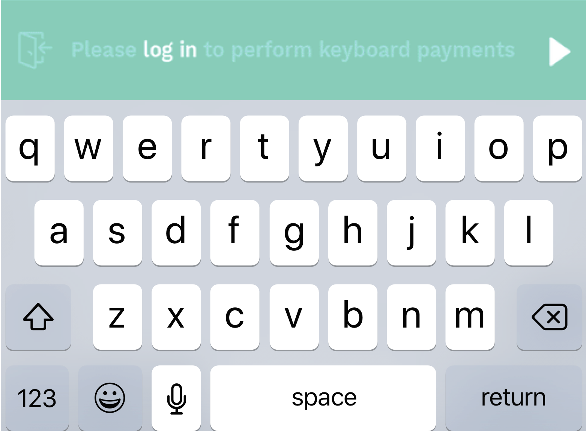
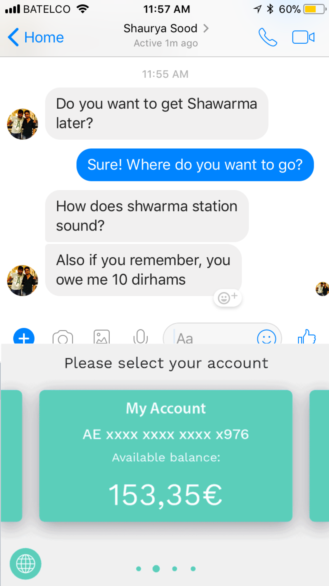
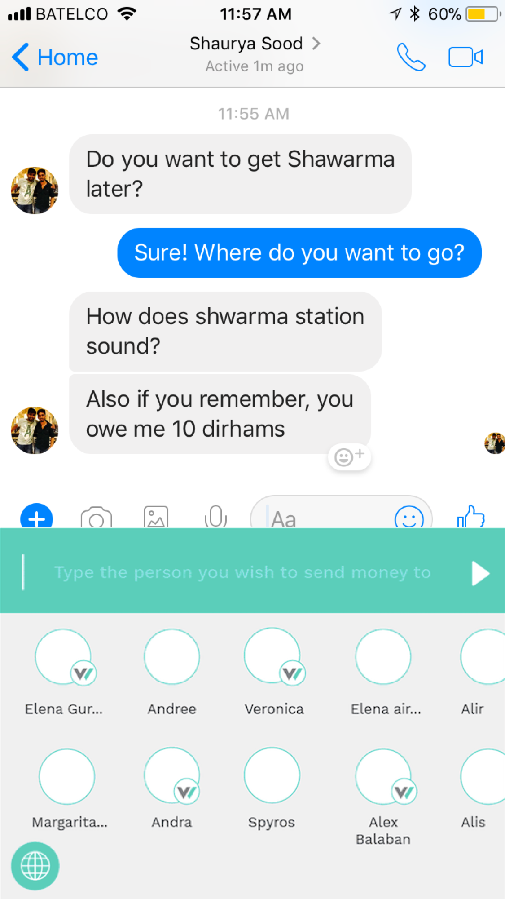
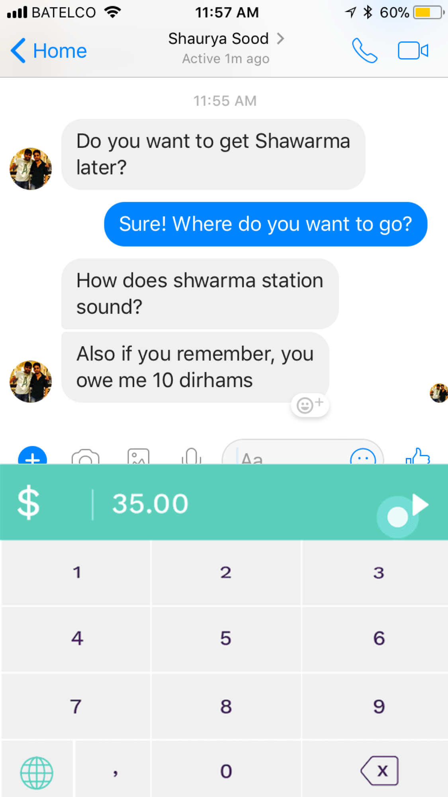

# PayBoard
### Bahrain Hackathon (Hack@TheTrack)

Payment Keyboard Application **P2P/remittances transactions through all apps**

#### How It Works
- Install and switch to PayBoard keyboard on your device. Add card in app
- Input your username, password,  card 
- Select the person you want to send money to
- Input amount and note
- Authenticate using TouchID
- Transaction Complete!

